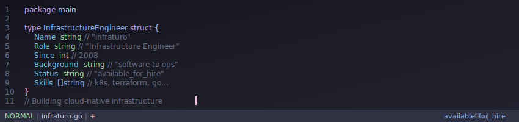

# Infrastructure Engineer

<div align="center">



</div>

## About

```go
package main

import (
    "fmt"
    "time"
)

type InfrastructureEngineer struct {
    Name                     string
    Role                     string
    SoftwareExperience       time.Duration
    InfrastructureExperience time.Duration
    Background               string
    Status                   string
    Location                 string
    Environment              Environment
    Skills                   Skills
    CurrentFocus             []string
    Philosophy               []string
    Dotfiles                 []string
}

type Environment struct {
    OS           string
    Editor       string
    Terminal     string
    Shell        string
    Attitude     string
}

type Skills struct {
    Orchestration []string
    IaC          []string
    Cloud        []string
    Automation   []string
    Monitoring   []string
    Languages    []string
}

func NewInfraturo() *InfrastructureEngineer {
    return &InfrastructureEngineer{
        Name:                     "infraturo",
        Role:                     "Infrastructure Engineer",
        SoftwareExperience:       time.Hour * 24 * 365 * 16, // Since 2008
        InfrastructureExperience: time.Hour * 24 * 365 * 8,  // Transitioned ~2016
        Background:               "software-engineer-turned-ops",
        Status:                   "available_for_hire",
        Location:                 "remote",
        
        Environment: Environment{
            OS:       "linux",                    // The only real choice
            Editor:   "vim",                      // Because efficiency matters
            Terminal: "foot + tmux + tiling-wm",  // Peak productivity setup
            Shell:    "bash/zsh",                 // Home sweet home
            Attitude: "keyboard-driven",          // Mouse is for quitters
        },
        
        Skills: Skills{
            Orchestration: []string{"kubernetes", "docker", "helm"},
            IaC:          []string{"terraform"},
            Cloud:        []string{"aws", "gcp", "azure"},
            Automation:   []string{"github-actions", "jenkins", "gitlab-ci"},
            Monitoring:   []string{"prometheus", "grafana", "datadog"},
            Languages:    []string{"go", "python", "bash", "yaml"},
        },
        
        CurrentFocus: []string{
            "platform-engineering",
            "developer-experience",
            "gitops-workflows",
            "infrastructure-as-code",
        },
        
        Philosophy: []string{
            "linux-is-life",
            "vim-keybindings-everywhere",
            "terminal-over-gui",
            "automation-over-manual-processes",
            "infrastructure-should-be-code",
        },
        
        Dotfiles: []string{
            "gitlab.com/wd2nf8gqct/dotfiles.core", // Core system configs
            "gitlab.com/wd2nf8gqct/dotfiles.di",   // Desktop integration
        },
    }
}

func (ie *InfrastructureEngineer) GetContactInfo() map[string]string {
    return map[string]string{
        "github":   "github.com/arturo-builds-infra",
        "linkedin": "linkedin.com/in/arturo-builds-infra",
    }
}

func (ie *InfrastructureEngineer) GetUniqueValue() string {
    return "Software engineering mindset applied to infrastructure challenges"
}

func main() {
    engineer := NewInfraturo()
    
    fmt.Printf("// %s - %s\n", engineer.Name, engineer.Role)
    fmt.Printf("// %s\n", engineer.GetUniqueValue())
    fmt.Printf("// Since 2008: Software → Infrastructure\n")
    fmt.Printf("// foot + tmux + tiling WM = peak productivity\n\n")
    
    if engineer.Status == "available_for_hire" {
        fmt.Println("⚡ Ready for new challenges")
    }
}
```

## What I Do

🏗️ **Infrastructure as Code** - Everything versioned, reviewed, and deployed through code  
☸️ **Kubernetes Orchestration** - Container workloads at scale  
☁️ **Multi-Cloud Architecture** - AWS, GCP, Azure expertise  
🔄 **GitOps Workflows** - Git as the single source of truth  
📊 **Observability** - Prometheus, Grafana, and comprehensive monitoring  

## My Journey

Started as a software engineer in **2008**, building applications and learning the craft of code. Around **2016**, I transitioned into infrastructure and operations, bringing my development background with me.

This unique perspective means I:
- Write infrastructure like software (testing, versioning, CI/CD)
- Understand developer pain points and optimize for DX
- Bridge the gap between dev and ops teams
- Automate everything that can be automated

## Working Style

🐧 **Linux Native** - Ubuntu, CentOS, Alpine... if it runs in production, I'm comfortable with it  
⌨️ **Vim Enthusiast** - hjkl navigation is muscle memory. Can make do with Mac when required, but let's be real - we're infrastructure people working on Linux machines  
🖥️ **foot + tmux + tiling WM** - Peak terminal productivity setup. Session persistence, window management, zero mouse dependency  
🔧 **Keyboard Driven** - Why reach for a mouse when Super+hjkl gets you anywhere? Tiling window managers just make sense  
💻 **CLI First** - If there's not a command-line tool for it, I'll probably write one  

## Dotfiles & Configs

Because great infrastructure starts with a great development environment:

⚙️ **[Core Configs](https://gitlab.com/wd2nf8gqct/dotfiles.core)** - Essential system configurations, shell setup, and core utilities  
🖥️ **[Desktop Integration](https://gitlab.com/wd2nf8gqct/dotfiles.di)** - Window manager configs, terminal setup, and desktop environment tweaks  

*Everything version controlled, documented, and reproducible. Because your environment should be infrastructure too.*

## Currently

🔍 **Exploring**: Platform engineering, developer experience improvements  
💼 **Status**: Available for consulting and full-time opportunities  
🌍 **Location**: Remote-first  

---

<div align="center">

**Let's build something amazing together**

[🐙 GitHub](https://github.com/arturo-builds-infra) • [💼 LinkedIn](https://www.linkedin.com/in/arturo-builds-infra/) • [🦊 GitLab](https://gitlab.com/wd2nf8gqct)

</div>
